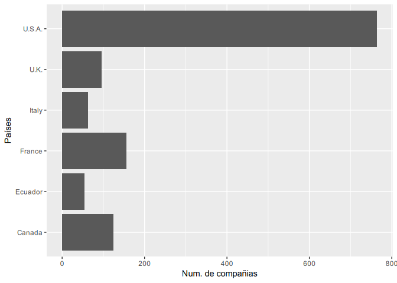
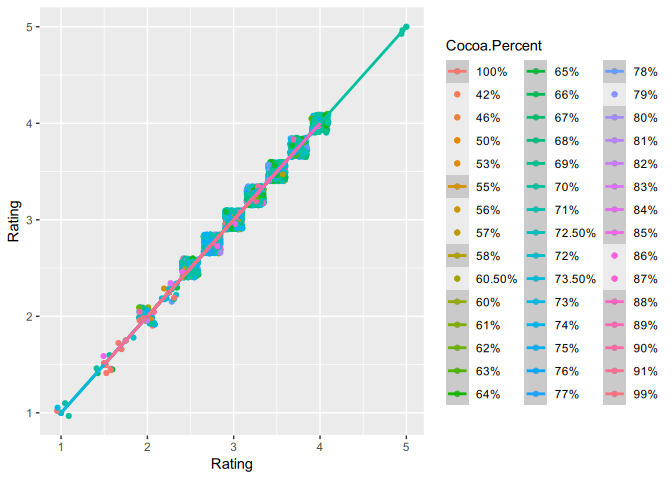

El chocolate
================
MVAP, MVAP2, MVAP3
2024-11-19

- [Intruducción](#intruducción)
  - [1.1 El chocolate](#11-el-chocolate)
  - [1.2 Los datos](#12-los-datos)
  - [1.3 Hipótesis](#13-hipótesis)
- [Materiales y Methods](#materiales-y-methods)
- [Resultados](#resultados)
- [Conclusiones](#conclusiones)
- [Información de la sesión y
  referencias](#información-de-la-sesión-y-referencias)

<!-- Antes de comenzar !!!
debes crear el archivo con las referencias de R y los paquetes que vayas a utilizar.  
Puedes actualizar el archivo en cualquier momento, sólo copia en la terminal el siguiente código y añade el nuevo paquete a la lista, se creará un nuevo archivo con las referencias en el formato adecuado "BibTeX". De forma automática incluye la referencia de R-->
<!-- knitr::write_bib(c(.packages(), 'dplyr', 'ggplot2', 'knitr', 'tinytex'), 'libraries.bib') -->
<!-- Inicio Rmd -->
<!-- Configuración global de los bloques de código, `echo = TRUE` -> todo el código utilizado en este documento aparecerá en el documento final salvo que se expecifique lo contrario, a excepción de este bloque de código, `include=TRUE`  -->
<!-- Para generar títulos, subtítulos etc se usa # el número de # determina el estilo y el formato del texto -->

## Intruducción

### 1.1 El chocolate

<!-- Trabajamos los diferentes estilos de text (negrita, cursiva, tachado, superíndice y subíndice), notas a pie de página [^N], citas > y referencias [@código] -->
<!-- En HTML podemos usar la etiqueda de css para usar diferentes colores en el texto:  -->
<!--  -->

El **chocolate** (del náhuatl,
*xocoatl*)[^1] [^2] es el alimento que se obtiene mezclando azúcar con
dos producto**s** que
derivan de l**a**
manipulación de las ~~semillas~~ del cacao: la masa del cacao y la
manteca de cacao. A partir de esta combinación básica se elaboran los
distintos tipos de chocolate que dependen de la proporción entre estos
elementos y de su mezcla, o no, con otros productos ya sea como leche,
colorante, y/o frutos secos ([Kiss et al.
2024](#ref-kiss_modified_2024)).

En 1896 El famoso gastrónomo francés J. A. Brillat-Savarin definió
chocolate de la siguiente manera

> “Se ha convenido en dar el nombre de chocolate a la mezcla compuesta
> de la semilla del árbol del cacao tostada, que lleva azúcar y canela;
> tal es la definición clásica del chocolate. El azúcar forma parte
> integrante, porque con cacao sólo resulta únicamente pasta de cacao y
> no chocolate.”

### 1.2 Los datos

<!-- cargar las librerias que vamos a utilizar, queremos que el código se ejecute, pero no que aparezca en el documento final, también excluímos los avisos y mensajes -->
<!-- Leer los datos desde el fichero que está en la misma carpeta que Rmarkdown. Si el fichero está en otra carpeta actualizar la localización del archivo -->
<!-- Trabajamos los links a páginas/archivos externos  y el código R en línea -->

Los datos de este proyectos fueron descargados desde
[kaggle](https://www.kaggle.com). Participaron 416 compañias fabricantes
de cocholate y se incluyeron chocolates de 100 paises diferentes.

<!-- insertar nueva página -->
<!-- Primera vista de los datos -->

| Company..Maker.if.known. | Specific.Bean.Origin.or.Bar.Name | REF  | Review.Date | Cocoa.Percent | Company.Location | Rating | Bean.Type | Broad.Bean.Origin |
|:------------------------:|:--------------------------------:|:----:|:-----------:|:-------------:|:----------------:|:------:|:---------:|:-----------------:|
|         A. Morin         |           Agua Grande            | 1876 |    2016     |      63%      |      France      |  3.75  |           |     Sao Tome      |
|         A. Morin         |              Kpime               | 1676 |    2015     |      70%      |      France      |  2.75  |           |       Togo        |
|         A. Morin         |              Atsane              | 1676 |    2015     |      70%      |      France      |  3.00  |           |       Togo        |
|         A. Morin         |              Akata               | 1680 |    2015     |      70%      |      France      |  3.50  |           |       Togo        |
|         A. Morin         |              Quilla              | 1704 |    2015     |      70%      |      France      |  3.50  |           |       Peru        |
|         A. Morin         |             Carenero             | 1315 |    2014     |      70%      |      France      |  2.75  |  Criollo  |     Venezuela     |
|         A. Morin         |               Cuba               | 1315 |    2014     |      70%      |      France      |  3.50  |           |       Cuba        |
|         A. Morin         |           Sur del Lago           | 1315 |    2014     |      70%      |      France      |  3.50  |  Criollo  |     Venezuela     |
|         A. Morin         |          Puerto Cabello          | 1319 |    2014     |      70%      |      France      |  3.75  |  Criollo  |     Venezuela     |
|         A. Morin         |             Pablino              | 1319 |    2014     |      70%      |      France      |  4.00  |           |       Peru        |

Tabla 1: Diez primeras filas

Los datos tienen 1795 entradas. Si los ordenamos por número de empresas:

<!-- calcular el número de compañias por pais con la función `count` y guardar los datos ordenados de forma descendiente en variable nueva -->
<!-- Utilizar la variable nueva para hacer un gráfico de barras incluyendo el pie de figura y la posición -->

Fig 1. Paises top productores de barras de chocolate

### 1.3 Hipótesis

Nuestra hipótesis es que cuanto mayor es el porcentaje de cacao mayor es
el rating.

## Materiales y Methods

<!-- Para indicar una referencia se utiliza [@codigo] -->

Para llevar a cabo el análisis usamos R ([R Core Team
2024](#ref-R-base)) con las librerias dplyr ([Wickham et al.
2023](#ref-R-dplyr)) y ggplot ([Wickham et al. 2024](#ref-R-ggplot2);
[Wickham 2016](#ref-ggplot22016)). Para la creación de este informe
hemos utilizado el paquete knitr ([Xie 2024](#ref-R-knitr),
[2015](#ref-knitr2015), [2014](#ref-knitr2014)) y pandoc y para crear
PDFs tinytex ([Xie 2019](#ref-tinytex2019))

## Resultados

Los chocolates mejor valorados tienen entre 60 y 70% de cacao (Fig 2).

<figure>

<figcaption aria-hidden="true">Fig 2. relación entre el ratio y el
porcentaje de cacao</figcaption>
</figure>

## Conclusiones

Los datos no apoyan nuestra hipótesis.

------------------------------------------------------------------------

<!-- Para asegurar la reproducibilidad de los resultados es necsario conocer el sistema operativo y la version de software y paquetes -->

## Información de la sesión y referencias

    ## Warning: Your system is mis-configured: '/etc/localtime' is not a symlink

    ## Warning: '/etc/localtime' is not identical to any known timezone file

    ## R version 4.3.3 (2024-02-29)
    ## Platform: x86_64-pc-linux-gnu (64-bit)
    ## 
    ## Matrix products: default
    ## BLAS:   /usr/local/lib64/R.4.3.3/lib/libRblas.so 
    ## LAPACK: /usr/local/lib64/liblapack.so.3.10.1
    ## 
    ## locale:
    ##  [1] LC_CTYPE=es_ES.UTF-8       LC_NUMERIC=C              
    ##  [3] LC_TIME=es_ES.UTF-8        LC_COLLATE=es_ES.UTF-8    
    ##  [5] LC_MONETARY=es_ES.UTF-8    LC_MESSAGES=es_ES.UTF-8   
    ##  [7] LC_PAPER=es_ES.UTF-8       LC_NAME=C                 
    ##  [9] LC_ADDRESS=C               LC_TELEPHONE=C            
    ## [11] LC_MEASUREMENT=es_ES.UTF-8 LC_IDENTIFICATION=C       
    ## 
    ## time zone: NA
    ## tzcode source: system (glibc)
    ## 
    ## attached base packages:
    ## [1] datasets  utils     grDevices graphics  stats     methods   base     
    ## 
    ## other attached packages:
    ## [1] ggplot2_3.5.1 dplyr_1.1.4  
    ## 
    ## loaded via a namespace (and not attached):
    ##  [1] vctrs_0.6.5       nlme_3.1-164      cli_3.6.3         knitr_1.49       
    ##  [5] rlang_1.1.4       xfun_0.49         generics_0.1.3    labeling_0.4.3   
    ##  [9] glue_1.8.0        colorspace_2.1-1  htmltools_0.5.8.1 scales_1.3.0     
    ## [13] fansi_1.0.6       rmarkdown_2.29    grid_4.3.3        munsell_0.5.1    
    ## [17] evaluate_1.0.1    tibble_3.2.1      fastmap_1.2.0     yaml_2.3.10      
    ## [21] lifecycle_1.0.4   compiler_4.3.3    pkgconfig_2.0.3   mgcv_1.9-1       
    ## [25] rstudioapi_0.17.1 lattice_0.22-5    farver_2.1.2      digest_0.6.37    
    ## [29] R6_2.5.1          tidyselect_1.2.1  utf8_1.2.4        splines_4.3.3    
    ## [33] pillar_1.9.0      magrittr_2.0.3    Matrix_1.6-5      withr_3.0.2      
    ## [37] tools_4.3.3       gtable_0.3.6

Kiss, Tibor, Zoltán Karácsony, Adrienn Gomba-Tóth, Kriszta Lilla
Szabadi, Zsolt Spitzmüller, Júlia Hegyi-Kaló, Thomas Cels, et al. 2024.
“A Modified CTAB Method for the Extraction of High-Quality RNA from
Mono-and Dicotyledonous Plants Rich in Secondary Metabolites.” *Plant
Methods* 20 (1): 62. <https://doi.org/10.1186/s13007-024-01198-z>.

R Core Team. 2024. *R: A Language and Environment for Statistical
Computing*. Vienna, Austria: R Foundation for Statistical Computing.
<https://www.R-project.org/>.

Wickham, Hadley. 2016. *Ggplot2: Elegant Graphics for Data Analysis*.
Springer-Verlag New York. <https://ggplot2.tidyverse.org>.

Wickham, Hadley, Winston Chang, Lionel Henry, Thomas Lin Pedersen,
Kohske Takahashi, Claus Wilke, Kara Woo, Hiroaki Yutani, Dewey
Dunnington, and Teun van den Brand. 2024. *Ggplot2: Create Elegant Data
Visualisations Using the Grammar of Graphics*.
<https://ggplot2.tidyverse.org>.

Wickham, Hadley, Romain François, Lionel Henry, Kirill Müller, and Davis
Vaughan. 2023. *Dplyr: A Grammar of Data Manipulation*.
<https://dplyr.tidyverse.org>.

Xie, Yihui. 2014. “Knitr: A Comprehensive Tool for Reproducible Research
in R.” In *Implementing Reproducible Computational Research*, edited by
Victoria Stodden, Friedrich Leisch, and Roger D. Peng. Chapman;
Hall/CRC.

———. 2015. *Dynamic Documents with R and Knitr*. 2nd ed. Boca Raton,
Florida: Chapman; Hall/CRC. <https://yihui.org/knitr/>.

———. 2019. “TinyTeX: A Lightweight, Cross-Platform, and Easy-to-Maintain
LaTeX Distribution Based on TeX Live.” *TUGboat* 40 (1): 30–32.
<https://tug.org/TUGboat/Contents/contents40-1.html>.

———. 2024. *Knitr: A General-Purpose Package for Dynamic Report
Generation in r*. <https://yihui.org/knitr/>.

[^1]: Hernández Triviño, Ascensión (2013-12). «Chocolate: historia de un
    nahuatlismo». Estudios de cultura náhuatl 46: 37-87. ISSN 0071-1675.
    Consultado el 7 de marzo de 2021.

[^2]: Real Academia Española. «chocolate». Diccionario de la lengua
    española (23.ª edición).
